# GhostSOC — UML & Architecture Documentation

**Repository analyzed:** `https://github.com/Dhrona1421/GhostSOC` (default branch `main`, cloned for this analysis)
**Note on the requested URL:** the prompt referenced `Dhrona1421/GhostSOCadvanced`, which returns HTTP 404 and does not appear to exist. The user subsequently confirmed the correct repository is `Dhrona1421/GhostSOC`, which is the repository this document analyzes.

All diagrams and claims below are derived directly from the source in this repository (`README.md`, `docs/*.md`, `backend/app/**`, `frontend/src/**`, `docker-compose.yml`, `.github/workflows/ci.yml`, `backend/tests/**`). Anything that could not be confirmed from the code is explicitly labeled **"Not confirmed from repository"**. The project's own README uses a "truthful status" framing (it distinguishes implemented, boundary/optional, and mocked components), and this documentation preserves that distinction rather than smoothing it over.

---

## 1. Executive Summary

GhostSOC is a self-contained **Security Operations Center (SOC) dashboard and safe-response orchestrator**. It is a two-tier web application: a **FastAPI (Python) backend** backed by **PostgreSQL** (source of truth) and **OpenSearch** (best-effort search index), fronted by a **React (Vite) single-page application** served through **Nginx**. The whole stack is defined as a **Docker Compose** project with four core services (`postgres`, `opensearch`, `backend`, `frontend`) plus two optional demo-runner containers.

The system ingests normalized endpoint/network telemetry and allowlisted web-traffic records, evaluates them against a small, deterministic **Sigma-compatible rule engine** and a **35-category web-attack catalog**, generates **Alerts**, deterministically **correlates** alerts into **Incidents** (4-hour host/IOC + MITRE technique bucketing), computes an **explainable risk score**, allows analysts to attach **evidence**, request **policy-gated response actions** (dry-run only by default), and **audits** every consequential action. Live updates reach the UI via **Server-Sent Events (SSE)**. Everything is guarded by **JWT authentication** and a three-role **RBAC** model (`ADMIN`, `ANALYST`, `VIEWER`) enforced in the backend, not just the UI.

A defining, explicitly documented architectural trait is **truthfulness about scope**: real external security products (Wazuh, Velociraptor, Arkime, MISP, OpenCTI, Shuffle, live CTI feeds) are represented only as configuration/health boundaries — GhostSOC never marks them "healthy" without a real check, and it never claims to have performed real containment. Response execution defaults to `DRY_RUN=true`.

---

## 2. Project Overview

| Attribute | Value (from repository) |
|---|---|
| Project name | **GhostSOC** |
| Purpose | Unified SOC dashboard + safe, policy-controlled security response orchestrator |
| Problem solved | Consolidates telemetry ingestion, Sigma-style detection, MITRE ATT&CK mapping, incident correlation, risk explanation, investigation, and *safe* (dry-run-first) response into one auditable system, instead of stitching together disparate SIEM/SOAR tools |
| Major features | Event ingestion & normalization; Sigma-compatible detection; 35-category web-attack detection; SSE live monitor; MITRE ATT&CK mapping; deterministic incident correlation; explainable risk scoring; SOC trend/attack-graph/network-topology/incident-relationship visualizations; global search; evidence collection; policy-gated response actions; audit trail; PDF/JSON/CSV/ZIP reporting; connector health registry; deterministic demo mode |
| Target users | Security Analyst, SOC Analyst/Administrator, System Administrator (implied by RBAC roles `ADMIN` / `ANALYST` / `VIEWER`), and API clients/telemetry sources feeding events |
| Major subsystems | Auth & RBAC; Event ingestion & normalization; Detection engine (Sigma + Web); Correlation & risk engine; Incident/investigation/evidence; Response orchestration; Audit; Reporting; Visualizations & search; Connector registry; Live/SSE broker |
| Technology stack | Python 3.11–3.13 / FastAPI / SQLAlchemy / Alembic / Pydantic / Argon2 / PyJWT (backend); React 18 + Vite + vanilla CSS (frontend); PostgreSQL 16 (or SQLite for dev/test); OpenSearch 2.19 (search adapter); Docker Compose; Nginx (frontend reverse proxy/static host) |
| Architectural style | Layered monolithic backend (API → services → SQLAlchemy models → PostgreSQL) with a decoupled SPA frontend, communicating over a JSON REST API plus one SSE stream. Not a microservices system. |
| Deployment model | Docker Compose, single-host, 4 core containers + 2 optional demo-profile containers; also supports non-container local development (`make run` + `npm run dev`) |
| External dependencies | PostgreSQL, OpenSearch (bundled containers); optionally Wazuh, Velociraptor, Arkime, MISP, OpenCTI, Shuffle, ThreatFox/URLhaus/MalwareBazaar (abuse.ch), AbuseIPDB, VirusTotal — all **boundary/optional**, never bundled |
| Database technology | PostgreSQL 16.4 (production/compose), SQLite (explicitly supported for local dev/tests only) |
| Frontend technology | React 18 (functional components + hooks), Vite build tool, plain CSS files, served by Nginx in production |
| Backend technology | FastAPI, SQLAlchemy 2.0 ORM (Mapped/mapped_column style), Alembic migrations, Pydantic v2 schemas, Argon2id password hashing, PyJWT HS256 tokens |
| Security components | JWT bearer auth (+ optional cookie/dashboard-token paths), Argon2id hashing, backend-enforced RBAC, correlation-ID middleware, security response headers, CORS allowlist, SSRF-safe connector URL validation, target-authorization checks for response actions, secret redaction in web telemetry, audit logging |
| Monitoring/detection components | Sigma-compatible `DetectionRule` engine (`backend/app/services/detection.py`), 35-category web-attack catalog (`backend/app/web_catalog.py`) + `web_detection.py`, MITRE ATT&CK curated metadata (`backend/app/mitre.py`), `DetectionCoverage` table, SSE live broker |
| Containerization/deployment components | `docker-compose.yml` (postgres, opensearch, backend, frontend, demo-runner, web-demo-runner), `backend/Dockerfile`, `frontend/Dockerfile` + `frontend/nginx.conf` |

### Concise architectural summary

GhostSOC is a **3-tier, layered monolith**: React SPA → Nginx reverse proxy → FastAPI application (itself layered: middleware → routers → services → SQLAlchemy models) → PostgreSQL (authoritative) with OpenSearch as a best-effort side index. Detection, correlation, response, and reporting are implemented as **service modules** invoked from **API route handlers**, not as separate microservices or background workers — there is **no message queue and no distributed task runner** in this codebase (see §34, Accuracy Rules). Live updates are pushed via an **in-process SSE broker** (`EventBroker`), explicitly documented as non-authoritative and non-clustered.

---

## 3. Repository Structure

```
GhostSOC/
├── .github/workflows/ci.yml         # CI: backend tests, frontend build, compose contract, release hygiene
├── backend/
│   ├── app/
│   │   ├── main.py                  # FastAPI app, middleware, exception handlers, router mounting
│   │   ├── models.py                # SQLAlchemy ORM models (16 tables)
│   │   ├── schemas.py                # Pydantic request/response schemas (core domain)
│   │   ├── web_schemas.py            # Pydantic schemas for web-security domain
│   │   ├── web_catalog.py            # 35-category web attack signature catalog
│   │   ├── mitre.py                  # Curated MITRE ATT&CK technique metadata
│   │   ├── api/
│   │   │   ├── routes.py             # Core REST routes (auth, events, incidents, response, reports, demo…)
│   │   │   ├── web_security.py       # Web-security REST routes + SSE stream
│   │   │   ├── visualizations.py     # Trends, network, attack-graph, incident-graph, global search
│   │   │   └── dependencies.py       # Auth dependency, RBAC dependency, DB session dependency
│   │   ├── core/
│   │   │   ├── config.py             # Pydantic Settings (env-driven), production safety validators
│   │   │   ├── database.py           # SQLAlchemy engine/session/Base
│   │   │   ├── security.py           # Password hashing, JWT issuance/verification, RBAC table
│   │   │   ├── bootstrap.py          # First-run admin user + default response policy seeding
│   │   │   └── logging.py            # Structured logging configuration
│   │   ├── services/
│   │   │   ├── ingestion.py          # Event persistence + detection/correlation trigger
│   │   │   ├── detection.py          # Sigma-compatible rule loader/validator/matcher
│   │   │   ├── web_detection.py      # Web-request → attack-detection pipeline
│   │   │   ├── correlation.py        # Incident correlation + risk scoring
│   │   │   ├── investigation.py      # Evidence collection (demo-mock boundary)
│   │   │   ├── response.py           # Response-action validation, policy gating, dry-run execution
│   │   │   ├── reporting.py          # PDF/JSON/CSV/ZIP report generation
│   │   │   ├── search.py             # OpenSearch indexing adapter
│   │   │   ├── realtime.py           # In-process SSE EventBroker
│   │   │   └── audit.py              # Audit log writer
│   │   └── connectors/
│   │       ├── base.py               # SSRF-safe HttpConnector + URL validation
│   │       ├── registry.py           # Declarative registry of 20 connector definitions + health checks
│   │       ├── cti.py                # Threat-intel provider adapters (ThreatFox, URLhaus, AbuseIPDB, VirusTotal…)
│   │       └── telemetry.py          # Sysmon/Zeek/Suricata/Cowrie source normalizers
│   ├── alembic/versions/             # 2 migrations: initial schema, web-security monitoring
│   ├── rules/*.yml                   # 3 bundled Sigma-compatible detection rules
│   ├── tests/                        # 11 pytest modules
│   └── Dockerfile
├── frontend/
│   └── src/
│       ├── App.jsx                   # Shell: nav, login, page routing, most page bodies
│       ├── GlobalTopbar.jsx          # Global search bar
│       ├── LiveSecurity.jsx          # Live Monitor / SSE-driven page
│       ├── ResponseConsole.jsx       # Response-action request/approval UI
│       ├── SecurityCharts.jsx        # SOC analytics charts
│       ├── Visualizations.jsx        # Attack graph, network mode, incident relationship graph
│       ├── GraphCanvas.jsx           # Shared SVG graph rendering primitive
│       └── api.js                    # Fetch wrapper + login helper
├── docs/                             # ARCHITECTURE, API, SECURITY, WEB_SECURITY, CONNECTORS, TESTING, UI, DEMO, …
├── scripts/demo_client.py            # Deterministic demo-runner client used by demo-runner containers
├── docker-compose.yml
└── README.md
```

---

## 4. Technology Stack (Traceable)

| Layer | Technology | Evidence |
|---|---|---|
| Backend framework | FastAPI | `backend/app/main.py` imports `fastapi.FastAPI` |
| ORM | SQLAlchemy 2.0 (`Mapped`/`mapped_column`) | `backend/app/models.py` |
| Migrations | Alembic | `backend/alembic/versions/*.py` |
| Validation | Pydantic v2 | `backend/app/schemas.py`, `web_schemas.py` |
| Auth | PyJWT (HS256), Argon2 (`argon2-cffi`) | `backend/app/core/security.py` |
| HTTP client (connectors) | `httpx` | `backend/app/connectors/base.py` |
| YAML rule parsing | `PyYAML` | `backend/app/services/detection.py` |
| DB drivers | `psycopg` (Postgres), SQLite (stdlib) | `docker-compose.yml` (`postgresql+psycopg://…`), README |
| Frontend | React 18, Vite | `frontend/package.json`, `frontend/vite.config.js` |
| Web server (prod) | Nginx (non-root) | `frontend/Dockerfile`, `frontend/nginx.conf` |
| Search | OpenSearch 2.19.3 | `docker-compose.yml` |
| Containers | Docker / Docker Compose v2 | `docker-compose.yml`, `backend/Dockerfile`, `frontend/Dockerfile` |
| CI | GitHub Actions | `.github/workflows/ci.yml` |
| Lint | Ruff (backend), ESLint (frontend) | CI workflow |
| Tests | pytest (+coverage ≥85%), (frontend test runner not confirmed beyond `npm run lint`/`build`) | CI workflow, `backend/tests/*` |

---

## 5. System Architecture

### 5.1 High-level architecture (from `docs/ARCHITECTURE.md`, verified against code)

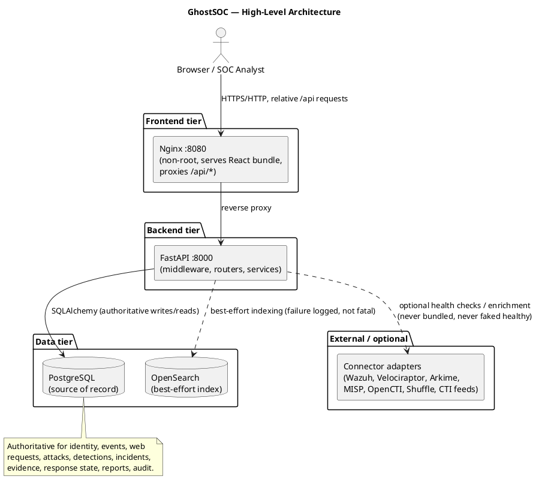

### 5.2 Request flow (documented in `docs/ARCHITECTURE.md`, matches `main.py` middleware)

1. Nginx serves the built React bundle and proxies relative `/api` calls to the backend (`frontend/nginx.conf`).
2. `request_context` middleware (`main.py`) assigns/validates `X-Correlation-ID`, times the request, and adds `X-Content-Type-Options`, `Referrer-Policy`, and `Cache-Control` response headers.
3. `get_current_user` (`api/dependencies.py`) resolves identity from a Bearer JWT, an `X-GhostSOC-Token` header, or a `ghostsoc_session` cookie (with a tightly-gated demo-auto-access fallback).
4. `require_permission(...)` dependencies enforce RBAC per-route using the `ROLE_PERMISSIONS` table in `core/security.py` — **authorization is enforced server-side**, not just hidden in the UI.
5. Pydantic schemas (`schemas.py`, `web_schemas.py`) validate and bound request payloads.
6. SQLAlchemy persists to PostgreSQL (or SQLite in dev/test).
7. Errors return a uniform envelope: `{"error": {"code","message","correlation_id"}}` via three exception handlers in `main.py` (`HTTPException`, `RequestValidationError`, generic `Exception`).

---

## 6. Use Case Model

### 6.1 Actors (confirmed from RBAC table + API surface)

| Actor | Evidence |
|---|---|
| **Administrator** (`role=ADMIN`) | `ROLE_PERMISSIONS["ADMIN"]` — full permission set including `MANAGE_CONNECTORS`, `MANAGE_RULES`, `APPROVE_RESPONSE`, `VIEW_AUDIT` |
| **Security/SOC Analyst** (`role=ANALYST`) | `ROLE_PERMISSIONS["ANALYST"]` — `VIEW_EVENTS`, `MANAGE_INCIDENTS`, `RUN_INVESTIGATION`, `EXECUTE_RESPONSE`, `EXPORT_REPORTS`, `VIEW_AUDIT` |
| **Viewer** (`role=VIEWER`) | `ROLE_PERMISSIONS["VIEWER"] = {"VIEW_EVENTS"}` — read-only |
| **Telemetry/API Client** | POSTs to `/api/v1/events`, `/api/v1/events/telemetry/{source_type}`, `/api/v1/web/requests` |
| **External security products** (Wazuh, Velociraptor, Arkime, MISP, OpenCTI, Shuffle) | `connectors/registry.py` — health/boundary only, **not actors that perform use cases inside GhostSOC** |
| **CTI Providers** (ThreatFox, URLhaus, AbuseIPDB, MalwareBazaar, VirusTotal) | `connectors/cti.py` — invoked by `POST /threat-intelligence/enrich` |

No "System Administrator" distinct from `ADMIN` was found; the README's mention of "Administrator" maps directly to the `ADMIN` role. No generic "Monitoring System" actor beyond OpenSearch/connector health checks was found.

### 6.2 Use Case Diagram

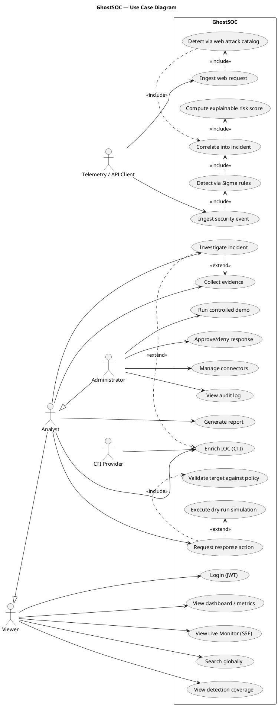

### 6.3 Selected use case detail

**UC10 — Request response action**
- Actor: Analyst or Administrator (permission `EXECUTE_RESPONSE`)
- Precondition: Incident exists; caller authenticated with a valid JWT
- Main flow: `POST /api/v1/response-actions` → `services/response.create_action()` validates action type against `ALLOWED_ACTIONS` (7 types), resolves an enabled `ResponsePolicy`, checks `incident.risk_level` against `policy.min_risk_level`, validates the target format per action type (`_validate_target`), and — if no approval is required — executes a **dry-run simulation** (`_execute_dry_run`), recording `execution_result.executed=false`.
- Alternative flow: If the action requires approval, the incident status becomes `CONTAINMENT_PENDING` and a second actor calls **UC11 — Approve/deny response** (`POST /response-actions/{id}/approval`).
- Postcondition: A `ResponseAction` row and an audit-log entry exist; the incident's status may change to `INVESTIGATING` (dry-run) or, only for a real, verified, non-dry-run adapter result, `CONTAINED`. **Real containment execution is not implemented** — any non-dry-run path deterministically fails closed (`"No real response adapter is configured; refusing execution"`).
- Related components: `api/routes.py` (`response_request`, `response_approval`), `services/response.py`, `models.ResponseAction`, `models.ResponsePolicy`.

**UC3 — Ingest security event → detect → correlate**
- Actor: Telemetry/API client
- Main flow: `POST /api/v1/events` (or `/events/telemetry/{source_type}`) → `services/ingestion.ingest_event()` persists a `SecurityEvent`, then calls `services/detection.detect_event()` (matches enabled Sigma-compatible rules field-by-field) which creates `Alert` rows, then `services/correlation.correlate_alert()` computes a deterministic correlation key and creates/joins an `Incident`, extracts IOCs, appends a `TimelineEvent`, and recomputes risk.
- Postcondition: Event, zero-or-more Alerts, and zero-or-one Incident (new or joined) persisted; IOCs attached to the incident.

---

## 7. Class Model

### 7.1 Domain / Database ORM model (SQLAlchemy — `backend/app/models.py`)

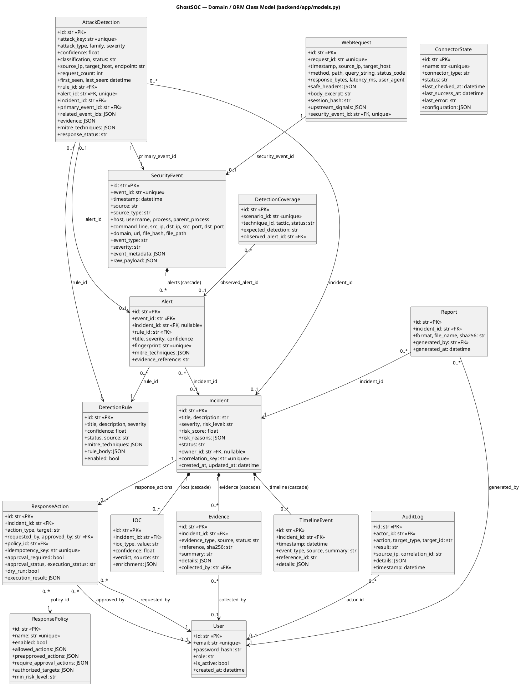

**Design note:** every table uses a UUID4 string primary key generated in Python (`new_id()`), not a database sequence — a deliberate choice to keep IDs generation-agnostic between PostgreSQL and SQLite (used in tests/dev).

### 7.2 Backend service/API layer class structure

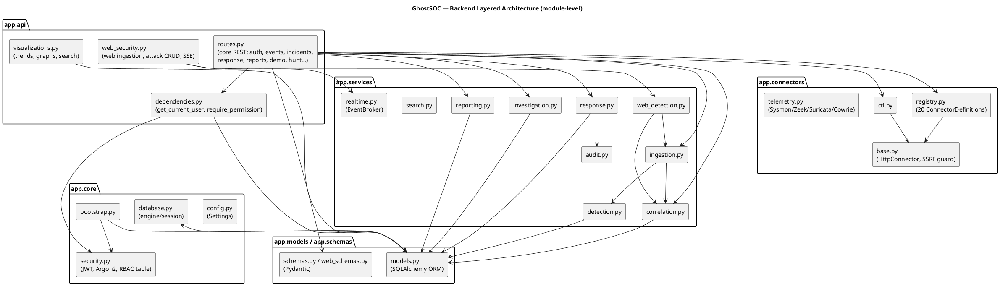

### 7.3 Frontend component structure

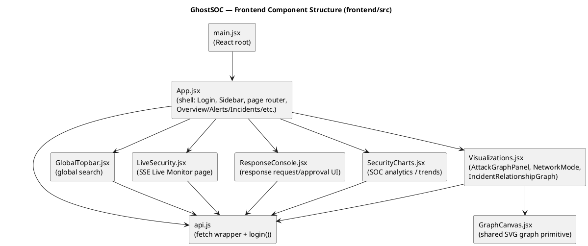

**Frontend navigation model** (from `App.jsx`, `NAV_GROUPS`): the SPA is not a multi-route router (no React Router found); it is a single-page shell with client-side `page` state switching between: *Overview, Live Monitor, Alerts, Attacks, Web Security* (Monitor group); *Incidents, Threat Intelligence, Hosts, Detection Coverage, Hunt* (Investigate group); *Reports, Integrations, Audit, Settings* (Manage group). Each maps to a REST endpoint via the `pageEndpoint` lookup table.

---

## 8. Component Architecture

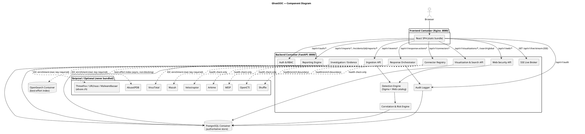

**Component responsibilities (traced to files):**

| Component | Responsibility | File(s) |
|---|---|---|
| Auth & RBAC | JWT issuance/verification, Argon2 password checks, permission table | `core/security.py`, `api/dependencies.py`, `api/routes.py` (auth routes) |
| Ingestion API | Accept/validate normalized events and telemetry-source payloads | `api/routes.py` (`create_event`, `create_telemetry_event`), `services/ingestion.py` |
| Web-Security API | Accept allowlisted web requests, manage attack detections, SSE demo replay | `api/web_security.py` |
| Detection Engine | Evaluate Sigma-compatible rules + 35-category web catalog | `services/detection.py`, `services/web_detection.py`, `web_catalog.py`, `rules/*.yml` |
| Correlation & Risk Engine | Deterministic 4-hour host/IOC + technique correlation, explainable scoring | `services/correlation.py` |
| Investigation / Evidence | Attach evidence to incidents (authorized-target gated) | `services/investigation.py` |
| Response Orchestrator | Validate/authorize/execute (dry-run) response actions | `services/response.py` |
| Reporting Engine | Generate PDF/JSON/CSV/ZIP incident reports | `services/reporting.py` |
| Audit Logger | Persist actor/action/result/correlation trail | `services/audit.py` |
| Visualization & Search API | Derive trend/graph/topology aggregates and global search from persisted tables | `api/visualizations.py` |
| SSE Live Broker | In-process pub/sub for live notifications | `services/realtime.py` |
| Connector Registry | Declarative inventory + SSRF-safe health checks for 20 external tool integrations | `connectors/registry.py`, `connectors/base.py` |

---

## 9. Deployment Architecture

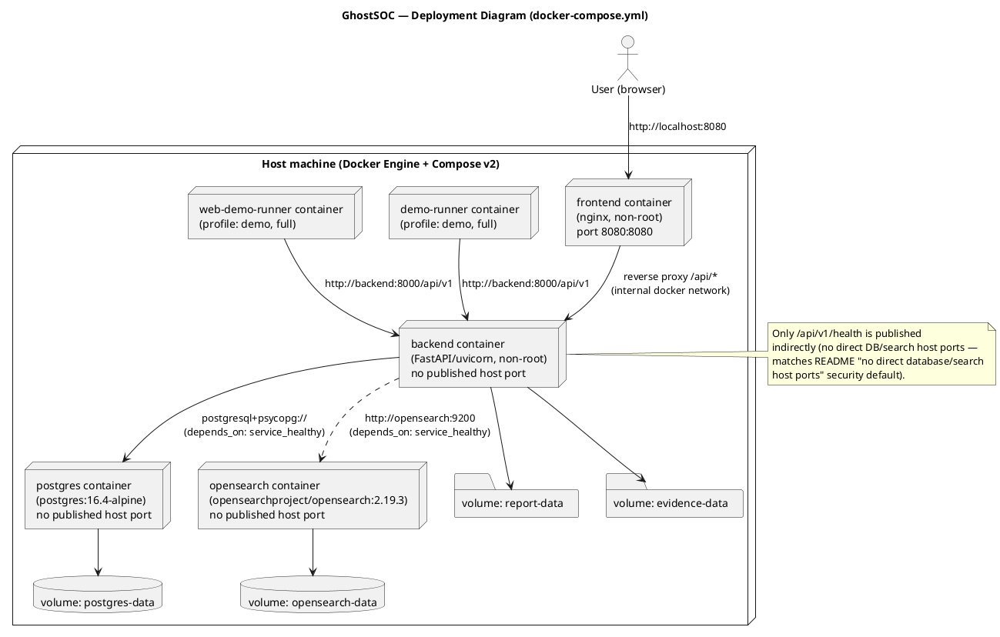

**Notes grounded in the compose file:**
- Only the **frontend** service publishes a host port (`8080:8080`); `backend`, `postgres`, and `opensearch` have **no `ports:` mapping**, confirming the README's "no direct database/search host ports" claim.
- `backend` has `depends_on: {postgres: service_healthy, opensearch: service_healthy}` — startup order is enforced via Compose healthchecks, not an external orchestrator.
- `demo-runner` / `web-demo-runner` only run under the `demo` or `full` Compose **profiles** and exit after one run (`restart: "no"`).
- All services set `security_opt: [no-new-privileges:true]`.
- **Kubernetes, Helm charts, or cloud-specific infrastructure-as-code were not found in the repository** — deployment is Docker Compose only. (Not confirmed from repository: any hosted/cloud deployment target.)

---

## 10. Backend Architecture (Layered)

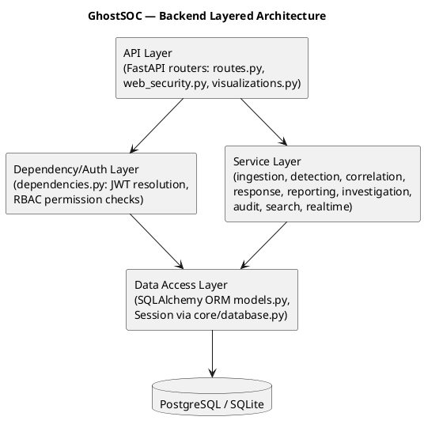

Middleware sits above the router layer inside `main.py`: correlation-ID assignment, security headers, structured logging, and three global exception handlers (`HTTPException`, `RequestValidationError`, generic `Exception`) that all funnel through a single JSON error envelope.

**Startup sequence (`lifespan` in `main.py`):** on boot, the app opens a `SessionLocal()`, runs `seed_foundation(db)` (bootstrap admin user + default response policy — `core/bootstrap.py`), then `sync_rules(db)` (loads/validates Sigma-compatible YAML rules from `backend/rules/*.yml`) and `sync_web_rules(db)` (loads the 35 web-attack catalog entries as `DetectionRule` rows), logging the resulting rule counts.

---

## 11. Frontend Architecture

- **Entry point:** `main.jsx` mounts `<App />` into the DOM (React 18 `createRoot`, confirmed pattern; exact API not fully re-verified line-by-line beyond import structure).
- **Pages:** rendered conditionally inside `App.jsx` based on `page` state and the `NAV_GROUPS`/`pageEndpoint` tables — Overview, Live Monitor, Alerts, Attacks, Web Security, Incidents, Threat Intelligence, Hosts, Detection Coverage, Hunt, Reports, Integrations, Audit, Settings.
- **State management:** local React state via `useState`/`useMemo`/`useCallback`/`useRef` (from `App.jsx` imports). **No Redux, MobX, or other global state library was found.**
- **API client:** `api.js` exports `api` (a fetch wrapper, presumably attaching the JWT and base path) and `login()`. Exact request/response shaping was not further decompiled line-by-line here but the import surface confirms this is the single network boundary for the SPA.
- **Auth flow:** `Login` component (`App.jsx`) posts credentials via `login(email, password)`; on success, the app renders `Sidebar` + the selected page; sign-out is hidden entirely when `autoAccess` demo mode is active.
- **Live updates:** `LiveSecurity.jsx` consumes the backend SSE stream (`GET /api/v1/live/stream`) for the Live Monitor page.
- **Visualization primitives:** `GraphCanvas.jsx` is a shared SVG rendering component reused by `Visualizations.jsx` for the attack graph, network topology ("NetworkMode"), and incident relationship graph — consistent with the architecture doc's claim of "deterministic layouts, not long-running physics simulation."

### 11.1 Frontend → Backend sequence (representative — loading the Overview dashboard)

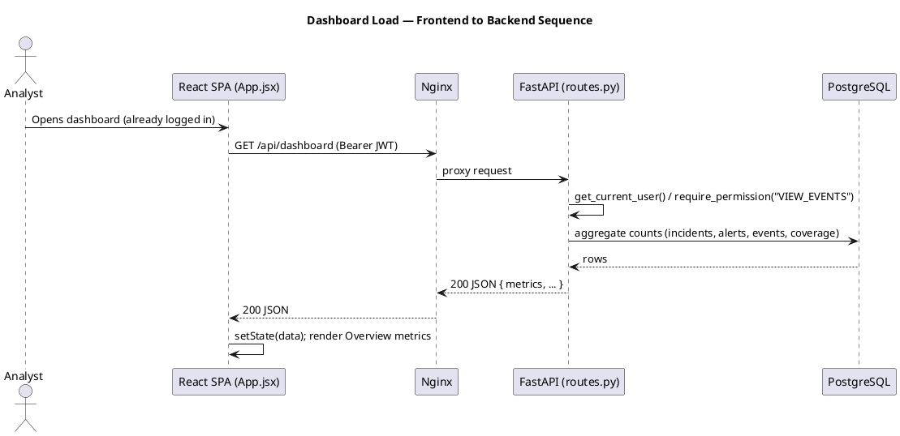

---

## 12. Database Architecture & Entity Relationship Diagram

Alembic migrations (`backend/alembic/versions/`) create exactly these tables, matching `models.py` 1:1: `users`, `connector_states`, `security_events`, `web_requests`, `detection_rules`, `alerts`, `attack_detections`, `incidents`, `iocs`, `evidence`, `timeline_events`, `response_policies`, `response_actions`, `audit_logs`, `reports`, `detection_coverage`. Two migrations exist: `673a0121be01_initial_ghostsoc_schema.py` (base schema) and `3f1186d33919_add_web_security_monitoring.py` (adds `web_requests` / `attack_detections` and related web-security columns).

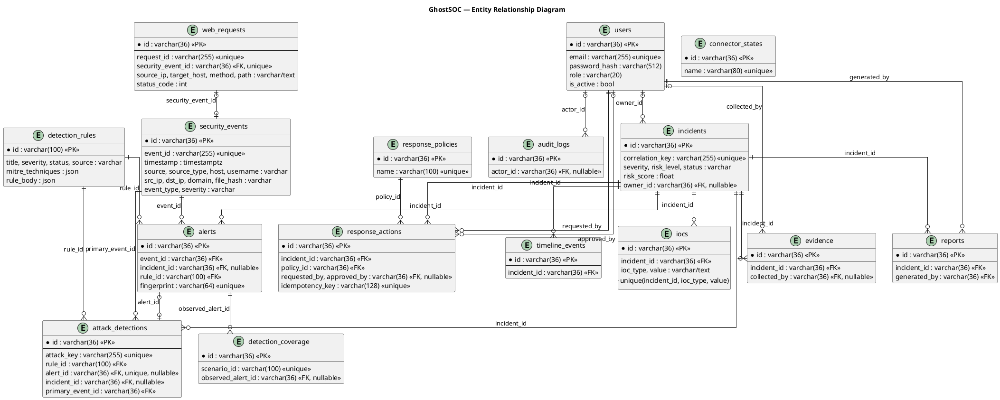

---

## 13. API Architecture

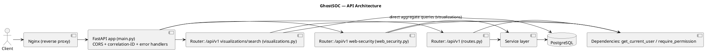

### 13.1 Endpoint inventory (representative — grounded in `api/routes.py`, `api/web_security.py`, `api/visualizations.py`)

| Method | Endpoint | Purpose | Handler | Service | Data Model |
|---|---|---|---|---|---|
| GET | `/api/v1/health` | Liveness | `health` | — | — |
| GET | `/api/v1/ready` | Dependency readiness | `readiness` | — | — |
| GET | `/api/v1/auth/demo-access` | Demo-mode preview status | `demo_access` | — | `User` |
| POST | `/api/v1/auth/login` | JWT login | `login` | `core.security` | `User` |
| POST | `/api/v1/auth/logout` | Clear session cookie | `logout` | — | — |
| GET | `/api/v1/auth/me` | Current user | `me` | — | `User` |
| GET | `/api/v1/auth/permissions` | Current role's permissions | `permissions` | `core.security` | — |
| POST | `/api/v1/events` | Ingest normalized event | `create_event` | `services.ingestion` | `SecurityEvent`, `Alert`, `Incident` |
| POST | `/api/v1/events/telemetry/{source_type}` | Ingest source-specific telemetry | `create_telemetry_event` | `connectors.telemetry`, `services.ingestion` | `SecurityEvent` |
| GET | `/api/v1/events` | List/filter events | `events` | — | `SecurityEvent` |
| GET | `/api/v1/hunt` | Threat-hunting query | `hunt` | — | `SecurityEvent` |
| GET | `/api/v1/hosts` | Host inventory (derived) | `hosts` | — | `SecurityEvent` |
| GET | `/api/v1/iocs` | List IOCs | `iocs` | — | `IOC` |
| GET | `/api/v1/timeline` | Global/incident timeline | `timeline` | — | `TimelineEvent` |
| GET | `/api/v1/mitre` | MITRE technique metadata | `mitre` | `mitre.py` | — |
| GET | `/api/v1/users` | List users | `users` | — | `User` |
| GET | `/api/v1/response-policies` | List policies | `response_policies` | — | `ResponsePolicy` |
| GET | `/api/v1/incidents/{id}/response-context` | Response decision context | `incident_response_context` | — | `Incident`, `ResponsePolicy` |
| GET | `/api/v1/alerts` | List alerts | `alerts` | — | `Alert` |
| GET | `/api/v1/detections` | List detections | `detections` | — | `Alert`/`AttackDetection` |
| GET | `/api/v1/incidents` | List incidents | `incidents` | — | `Incident` |
| GET | `/api/v1/incidents/{id}` | Incident detail | `incident_detail` | — | `Incident` |
| PATCH | `/api/v1/incidents/{id}` | Update incident | `update_incident` | — | `Incident` |
| POST | `/api/v1/incidents/{id}/evidence` | Collect evidence | `collect_incident_evidence` | `services.investigation` | `Evidence` |
| POST | `/api/v1/threat-intelligence/enrich` | Enrich IOC via CTI | `enrich_ioc` | `connectors.cti` | `IOC` |
| GET | `/api/v1/connectors` | List connector health | `connectors` | `connectors.registry` | `ConnectorState` |
| PATCH | `/api/v1/connectors/{name}` | Update connector config | `connector_update` | `connectors.registry` | `ConnectorState` |
| POST | `/api/v1/connectors/{name}/check` | Trigger health check | `connector_check` | `connectors.registry` | `ConnectorState` |
| POST | `/api/v1/response-actions` | Request response action | `response_request` | `services.response` | `ResponseAction` |
| POST | `/api/v1/response-actions/{id}/approval` | Approve/deny action | `response_approval` | `services.response` | `ResponseAction` |
| GET | `/api/v1/response-actions` | List response actions | `response_actions` | — | `ResponseAction` |
| GET | `/api/v1/audit` | List audit log | `audit_logs` | — | `AuditLog` |
| POST | `/api/v1/incidents/{id}/reports/{format}` | Generate report | `create_report` | `services.reporting` | `Report` |
| GET | `/api/v1/reports/{id}/download` | Download report | `download_report` | `services.reporting` | `Report` |
| GET | `/api/v1/coverage` | Detection coverage | `coverage` | — | `DetectionCoverage` |
| GET | `/api/v1/dashboard` | Aggregated overview metrics | `dashboard` | — | multiple |
| POST | `/api/v1/demo/run` | Deterministic endpoint demo | `run_demo` | — | multiple |
| POST | `/api/v1/demo/reset` | Reset endpoint demo state | `reset_demo` | — | multiple |
| GET | `/api/v1/web/attack-catalog` | List 35 attack categories | `attack_catalog` | `web_catalog.py` | — |
| POST | `/api/v1/web/requests` | Ingest allowlisted web request | `create_web_request` | `services.web_detection` | `WebRequest` |
| GET | `/api/v1/web/requests` | List web requests | `web_requests` | — | `WebRequest` |
| GET | `/api/v1/web/attacks` | List attack detections | `attacks` | — | `AttackDetection` |
| PATCH | `/api/v1/web/attacks/{id}` | Update attack detection | `update_attack` | — | `AttackDetection` |
| GET | `/api/v1/web/attacks/{id}` | Attack detail | `attack_detail` | — | `AttackDetection` |
| GET | `/api/v1/web/summary` | Backend-derived web stats | `web_summary` | — | `WebRequest`, `AttackDetection` |
| GET | `/api/v1/web/replay` | Persisted replay records | `persisted_replay` | — | `WebRequest` |
| GET | `/api/v1/live/history` | Bounded SSE notification history | `live_history` | `services.realtime` | — |
| GET | `/api/v1/live/stream` | SSE live stream | `live_stream` | `services.realtime` | — |
| POST | `/api/v1/demo/web-run` | Deterministic web-attack replay demo | `run_web_demo` | — | multiple |
| POST | `/api/v1/demo/web-reset` | Reset web demo state | `reset_web_demo` | — | multiple |
| GET | `/api/v1/visualizations/trends` | SOC trend buckets | `security_trends` | — | multiple |
| GET | `/api/v1/visualizations/network` | Network topology graph | `network_topology` | — | `WebRequest`, `SecurityEvent` |
| GET | `/api/v1/visualizations/attack-graph` | Attack graph | `attack_graph` | — | `AttackDetection` |
| GET | `/api/v1/visualizations/incidents/{id}` | Incident relationship graph | `incident_graph` | — | `Incident` and related |
| GET | `/api/v1/search/global` | Typed global search | `global_search` | — | multiple |

---

## 14. Security Architecture

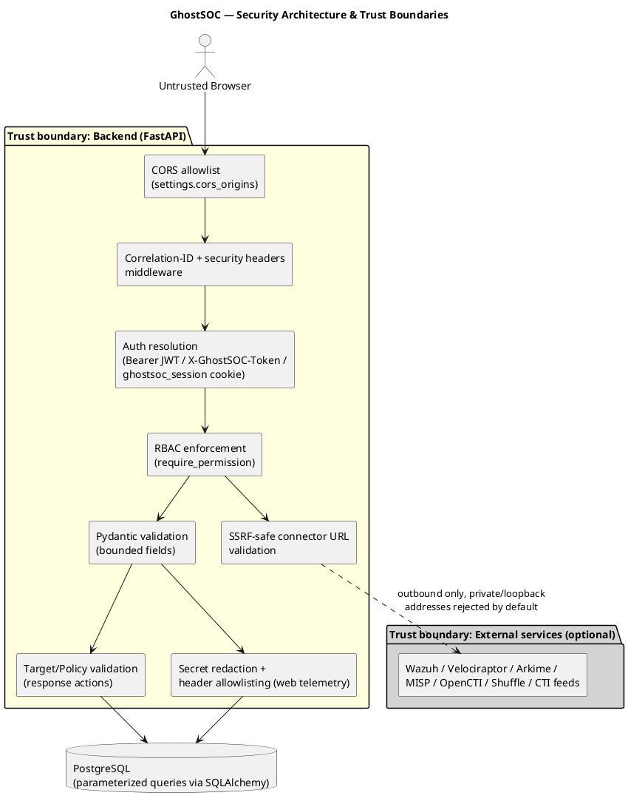

**Grounded security controls:**

| Control | Evidence |
|---|---|
| Password hashing | Argon2id, `time_cost=2, memory_cost=19456, parallelism=1`, min length 12 (`core/security.py`) |
| Tokens | JWT HS256, `iss=ghostsoc`, `aud=ghostsoc-api`, short expiry (`access_token_minutes`, default 60) (`core/security.py`) |
| RBAC | 3 roles × explicit permission sets, enforced via FastAPI `Depends(require_permission(...))` (`core/security.py`, `api/dependencies.py`) |
| Production hardening | `Settings.secure_production_defaults()` validator rejects production boot if: `demo_auto_access` on, weak/default `secret_key`, default admin password unchanged, `demo_mode` on, or insecure session cookie (`core/config.py`) |
| Response-action target validation | Regex/allowlist checks per action type (`services/response.py: _validate_target`) — rejects control characters/shell metacharacters, requires authorized hosts, requires IOC already attached to the incident, or a well-formed SHA-256 for file targets |
| Idempotency | `idempotency_key` unique constraint prevents duplicate response-action execution (`models.ResponseAction`, `services/response.create_action`) |
| SSRF protection on connectors | `connectors/base.py: validate_connector_url()` resolves DNS and rejects private/loopback/link-local/reserved IPs unless `GHOSTSOC_ALLOW_PRIVATE_CONNECTORS=true`; also rejects embedded credentials in URLs |
| Web telemetry sanitization | `services/web_detection.py`: header allowlist (`SAFE_HEADER_NAMES`), secret redaction regex, `session_hash` instead of raw session ID |
| CORS | `CORSMiddleware` restricted to configured origins, methods limited to `GET, POST, PATCH, OPTIONS` (`main.py`) |
| Response headers | `X-Content-Type-Options: nosniff`, `Referrer-Policy: no-referrer`, `Cache-Control: no-store` on `/api/*` (`main.py`) |
| No command execution surface | No endpoint accepts arbitrary shell/SQL; `services/response.py` uses an allowlist of 7 typed actions, always ending in `DRY_RUN` unless a real adapter exists (none does) |
| Container hardening | `security_opt: no-new-privileges:true` on all services; non-root Nginx and backend images (per README; Dockerfiles set non-root users) |

---

## 15. Detection Engineering Architecture

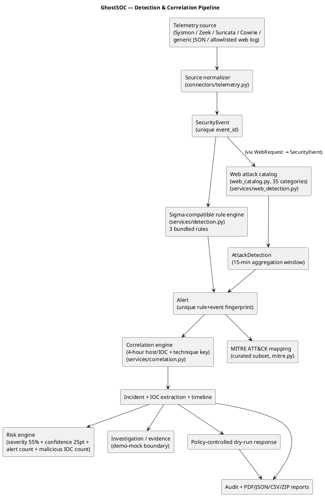

**Detection rule format (Sigma-compatible subset):** each YAML rule (`backend/rules/*.yml`) must contain `title`, `id`, `description`, `detection`, `level`. The `detection.condition` supports **only** named selections joined by `and`/`or` with `equals`, `contains`, `startswith`, `endswith` modifiers — parentheses and `|` (pipe) chains are explicitly rejected by `validate_rule()` (`services/detection.py`). This is a deliberately restricted, deterministic subset of Sigma, not a full Sigma implementation. Three bundled rules exist: `cowrie_shell_activity.yml`, `suricata_high_alert.yml`, `suspicious_powershell.yml`.

**Web attack catalog:** 35 categories (`web_catalog.py`), each a `WebAttackDefinition` with `number`, `slug`, `name`, `family`, `severity`, `base_confidence`, `detection_mode` (e.g., `SIGNATURE_OR_SIGNAL`, `CONTEXT_SIGNAL`, `BEHAVIORAL`), MITRE technique tuple, and regex `patterns`. Categories span injection (SQLi, XSS, command injection, SSTI, XXE), access control (IDOR, CSRF, business-logic abuse), credential attacks (brute force, credential stuffing, password spraying, session hijacking), API/protocol attacks (GraphQL, WebSocket, JWT, HTTP smuggling/parameter pollution), and infrastructure misconfigurations (CORS, cache poisoning/deception, host-header injection, open redirect). The README explicitly notes that **context-dependent categories (CSRF, IDOR, business-logic abuse, cache deception, CORS misconfiguration) require explicit upstream WAF/application signals** — GhostSOC does not claim to derive them from a raw access log alone.

**MITRE ATT&CK mapping:** `mitre.py` is a **curated dictionary subset** (technique id → name/tactics/URL) covering only the techniques referenced by bundled rules and the web catalog — explicitly documented as not a full ATT&CK mirror.

**Alert → Incident correlation key:** `f"{host_or_ioc}:{technique}:{four_hour_bucket}"` (`services/correlation.py: _correlation_key`) — deterministic, not ML-based.

**Risk scoring formula** (`services/correlation.py: _risk`): `score = SEVERITY_SCORE[top_alert.severity] * 0.55 + max(confidence) * 25 + min(10, (n_alerts-1)*3) + min(20, malicious_iocs*10)`, capped at 100, mapped to `LOW/MEDIUM/HIGH/CRITICAL` via thresholds 35/60/80. Reasons are persisted alongside the score in `incident.risk_reasons` (explainability).

---

## 16. Docker / Container Architecture

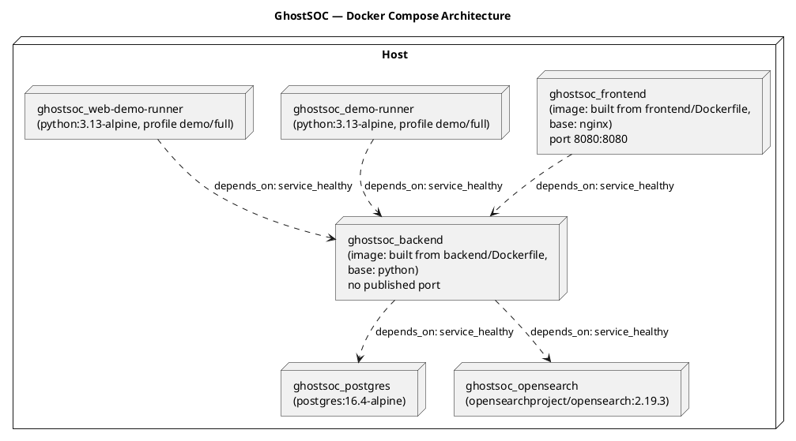

| Aspect | Value |
|---|---|
| Compose project name | `ghostsoc` |
| Networks | Default Compose bridge network (no custom `networks:` block defined — **not confirmed** to use a named/isolated network beyond Compose defaults) |
| Volumes | `postgres-data`, `opensearch-data`, `report-data`, `evidence-data` (all named, persistent) |
| Healthchecks | All 4 core services define a `healthcheck:` (pg_isready, curl cluster health, Python urllib GET `/api/v1/health`, wget on `/`) |
| Profiles | `demo`, `full` gate the two demo-runner services; `full` is also referenced by the README as "core + demo runner" |
| Security options | `no-new-privileges:true` on every service |
| Secrets handling | All credentials passed as environment variables with safe local-only defaults (e.g., `POSTGRES_PASSWORD:-ghostsoc-local-only`); `.env.example` documents required overrides |

---

## 17. Infrastructure Architecture

Infrastructure is entirely Docker Compose based — there is no Terraform, CloudFormation, Kubernetes manifest, or Helm chart in the repository. Configuration is centralized in `.env` (from `.env.example`) consumed both by Compose (interpolation) and by the backend's Pydantic `Settings` (`GHOSTSOC_`-prefixed environment variables, `core/config.py`). Persistent state lives in four named Docker volumes (§16). Health/readiness is exposed at `/api/v1/health` (liveness) and `/api/v1/ready` (dependency readiness, checked in `routes.py: readiness`).

---

## 18. Sequence Diagrams

### 18.1 User login

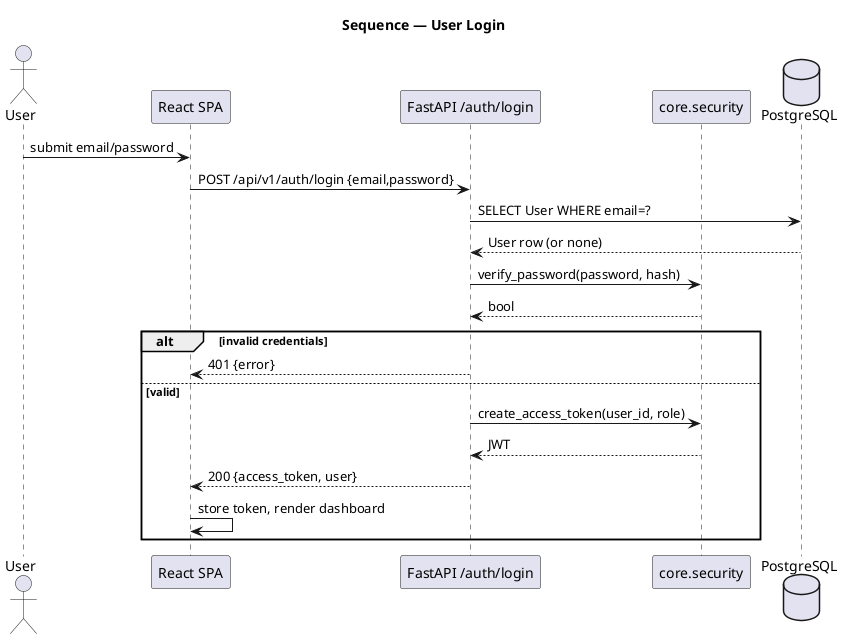

### 18.2 Security event ingestion → detection → correlation → incident

```plantuml
@startuml SeqIngestion
title Sequence — Security Event Ingestion & Detection
participant "Telemetry Source" as Src
participant "POST /events" as API
participant "services.ingestion" as Ingest
participant "services.detection" as Detect
participant "services.correlation" as Corr
database "PostgreSQL" as DB
participant "services.search\n(OpenSearch adapter)" as OS

Src -> API : POST /api/v1/events {event_id, ...}
API -> Ingest : ingest_event(db, payload)
Ingest -> DB : INSERT SecurityEvent
Ingest -> Detect : detect_event(db, event)
Detect -> DB : SELECT enabled DetectionRule(s)
loop each rule
  Detect -> Detect : rule_matches(event, rule)
  alt match
    Detect -> DB : INSERT Alert (fingerprint dedup)
  end
end
Detect --> Ingest : [Alert, ...]
loop each alert
  Ingest -> Corr : correlate_alert(db, alert, event)
  Corr -> Corr : compute correlation_key (host/IOC+technique+4h bucket)
  Corr -> DB : SELECT/INSERT Incident WHERE correlation_key=?
  Corr -> DB : INSERT IOC(s), TimelineEvent
  Corr -> Corr : _risk(alerts, iocs)
  Corr -> DB : UPDATE Incident risk_score/level/reasons
  Corr --> Ingest : Incident
end
Ingest --> API : (event, duplicate?, alert_count, incident_ids)
API --> Src : 201 {IngestResult}
API ..> OS : index_event(event) [async, best-effort]
@enduml
```

### 18.3 Alert generation (detail)

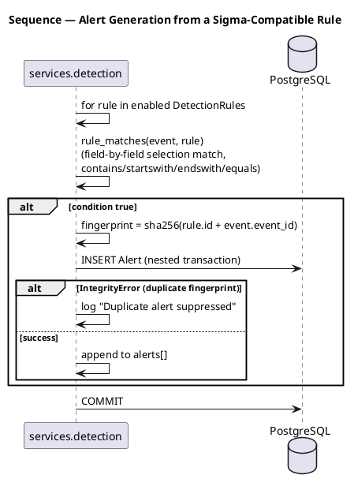

### 18.4 Response action request → dry-run execution

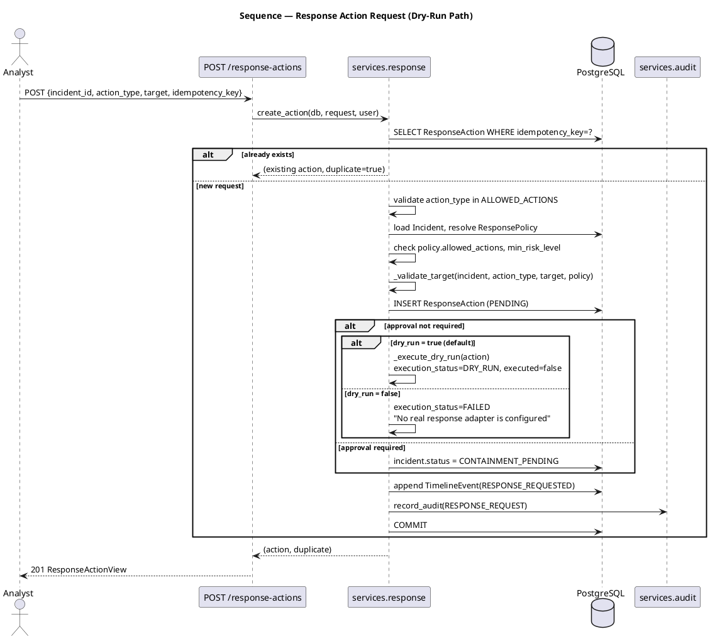

### 18.5 Web-security detection (SQLi/XSS/etc. via web catalog)

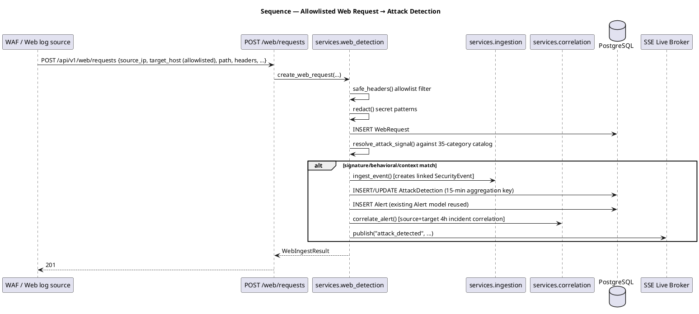

### 18.6 API request lifecycle (generic)

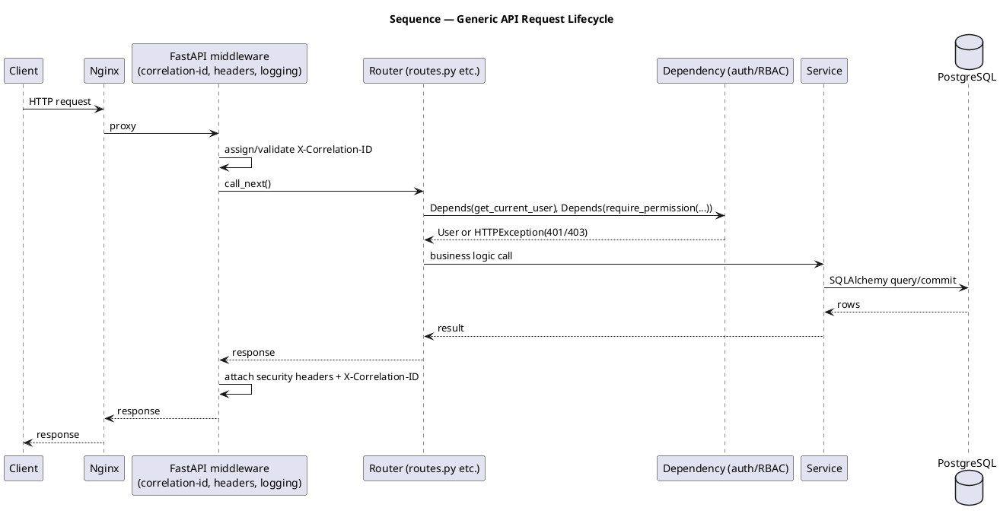

### 18.7 Docker Compose startup

```plantuml
@startuml SeqDockerStartup
title Sequence — Docker Compose Startup Order
participant "docker compose up -d" as Compose
participant postgres
participant opensearch
participant backend
participant frontend

Compose -> postgres : start
Compose -> opensearch : start
postgres -> postgres : healthcheck (pg_isready) until healthy
opensearch -> opensearch : healthcheck (cluster health) until healthy
Compose -> backend : start (depends_on both healthy)
backend -> backend : lifespan(): seed_foundation(),\nsync_rules(), sync_web_rules()
backend -> backend : healthcheck (GET /api/v1/health) until healthy
Compose -> frontend : start (depends_on backend healthy)
frontend -> frontend : healthcheck (GET /) until healthy
@enduml
```

### 18.8 Error handling flow

```plantuml
@startuml SeqErrorHandling
title Sequence — Error Handling Flow
participant Client
participant "FastAPI Router" as Router
participant "Pydantic Validation" as Valid
participant "Exception Handlers (main.py)" as Handlers

Client -> Router : request
Router -> Valid : parse/validate body
alt validation fails
  Valid -> Handlers : RequestValidationError
  Handlers --> Client : 422 {error:{code:VALIDATION_ERROR, details:[...], correlation_id}}
else business rule fails (e.g. policy check)
  Router -> Handlers : raise HTTPException(4xx)
  Handlers --> Client : {status} {error:{code:HTTP_{status}, message, correlation_id}}
else unhandled exception
  Router -> Handlers : Exception
  Handlers -> Handlers : logger.exception(...)
  Handlers --> Client : 500 {error:{code:INTERNAL_ERROR, correlation_id}}
end
@enduml
```

---

## 19. Activity Diagrams

### 19.1 Detection & correlation workflow

```plantuml
@startuml ActDetection
title Activity — Detection & Correlation Workflow
start
:Receive normalized SecurityEvent;
:Persist event (unique event_id);
if (event_id already exists?) then (yes)
  :Return existing event, 0 new alerts;
  stop
endif
:Load enabled Sigma-compatible rules;
fork
  :Evaluate rule 1 selections;
fork again
  :Evaluate rule N selections;
end fork
if (any rule matched?) then (yes)
  :Create Alert(s) with sha256 fingerprint;
  :Compute correlation_key (host/IOC + technique + 4h bucket);
  if (Incident with this key exists?) then (yes)
    :Join existing Incident;
  else (no)
    :Create new Incident;
  endif
  :Extract IOCs from event fields;
  :Append TimelineEvent;
  :Recompute risk_score / risk_level / risk_reasons;
else (no)
  :No alert created;
endif
stop
@enduml
```

### 19.2 Response-action authorization workflow

```plantuml
@startuml ActResponse
title Activity — Response Action Authorization
start
:Receive response-action request;
if (idempotency_key already used?) then (yes)
  :Return existing action (idempotent replay);
  stop
endif
if (action_type in ALLOWED_ACTIONS?) then (no)
  :422 - action not allowlisted;
  stop
endif
:Resolve enabled ResponsePolicy;
if (policy allows this action_type?) then (no)
  :403 - policy does not allow action;
  stop
endif
if (incident.risk_level >= policy.min_risk_level?) then (no)
  :403 - risk below policy minimum;
  stop
endif
:Validate target format per action type;
if (target invalid/unauthorized?) then (yes)
  :422 - target rejected;
  stop
endif
:Create ResponseAction (PENDING);
if (approval required?) then (yes)
  :incident.status = CONTAINMENT_PENDING;
  :Await analyst/admin decision;
else (no)
  if (dry_run enabled? [default true]) then (yes)
    :Execute simulated dry-run;
    :execution_status = DRY_RUN;
  else (no real adapter exists)
    :execution_status = FAILED (fail closed);
  endif
endif
:Append TimelineEvent + AuditLog;
stop
@enduml
```

### 19.3 Incident investigation workflow

```plantuml
@startuml ActInvestigation
title Activity — Security Investigation Workflow
start
:Analyst opens Incidents page;
:GET /api/v1/incidents (list, filterable by severity/status);
:Select incident;
:GET /api/v1/incidents/{id} (detail: alerts, IOCs, timeline, risk);
if (need more context?) then (yes)
  :POST /incidents/{id}/evidence (ENDPOINT_TRIAGE / YARA_SCAN / NETWORK_CONTEXT);
  note right: authorized_targets-gated;\ndemo-mock unless real adapter configured
  :POST /threat-intelligence/enrich (IOC enrichment via CTI connectors);
endif
:Review MITRE-mapped alerts and risk_reasons;
if (containment warranted?) then (yes)
  :POST /response-actions (see Response Action Authorization activity);
endif
:PATCH /incidents/{id} (update status/owner);
:POST /incidents/{id}/reports/{format} (optional export);
stop
@enduml
```

### 19.4 Deployment/startup workflow

```plantuml
@startuml ActDeployment
title Activity — Deployment / Startup Workflow (install.sh)
start
:Run ./install.sh or install.ps1;
if (.env exists?) then (yes)
  :Do not overwrite;
else (no)
  :Generate local credentials into .env;
endif
:Validate Docker Compose availability;
:docker compose build;
:docker compose up -d;
:Wait for postgres and opensearch healthchecks;
:Start backend (lifespan seeds admin user + rules);
:Wait for backend healthcheck (/api/v1/health);
:Start frontend (Nginx);
:Wait for frontend healthcheck;
:Print URL and generated password;
stop
@enduml
```

---

## 20. State Machine Diagrams

### 20.1 ResponseAction lifecycle

Directly evidenced by `services/response.py` and `docs/ARCHITECTURE.md`'s documented state machine:

```plantuml
@startuml StateResponseAction
title State Machine — ResponseAction
[*] --> PENDING : create_action()
PENDING --> APPROVED : decide_action(APPROVED) [if approval_required]
PENDING --> DENIED : decide_action(DENIED) [if approval_required]
PENDING --> RUNNING : approval not required
RUNNING --> SUCCESS : real adapter, executed=true & verified=true
RUNNING --> FAILED : no real adapter configured (fail-closed)
PENDING --> DRY_RUN : dry_run=true (default) & no approval required
APPROVED --> DRY_RUN : dry_run=true
APPROVED --> RUNNING : dry_run=false
DENIED --> CANCELLED
DRY_RUN --> [*]
SUCCESS --> [*]
FAILED --> [*]
CANCELLED --> [*]

note right of DRY_RUN
  execution_result.executed = false
  Never marks the incident CONTAINED.
end note
note right of SUCCESS
  Only reachable with a verified,
  non-dry-run adapter result.
  No such adapter exists in this
  codebase today (fails closed).
end note
@enduml
```

### 20.2 Incident lifecycle

`schemas.py` defines the `IncidentStatus` literal type; transitions below are those actually driven by code (`services/response.py`, `api/routes.py: update_incident`):

```plantuml
@startuml StateIncident
title State Machine — Incident
[*] --> NEW : correlate_alert() creates Incident
NEW --> TRIAGED : PATCH /incidents/{id}
TRIAGED --> INVESTIGATING : PATCH, or automatically after a DRY_RUN response
INVESTIGATING --> CONTAINMENT_PENDING : response action requires approval
CONTAINMENT_PENDING --> CONTAINED : verified non-dry-run response success (not currently reachable — no real adapter)
CONTAINMENT_PENDING --> INVESTIGATING : action denied / dry-run only
CONTAINED --> RECOVERING : PATCH /incidents/{id}
RECOVERING --> RESOLVED : PATCH /incidents/{id}
RESOLVED --> CLOSED : PATCH /incidents/{id}
@enduml
```
*(States `RECOVERING`, `RESOLVED`, `CLOSED` are declared in the `IncidentStatus` type and reachable via the generic `PATCH /incidents/{id}` update route, but no dedicated business-rule transition function for them was found beyond direct field update — labeled **inferred** from the schema, not a dedicated state-transition function.)*

### 20.3 AttackDetection lifecycle

```plantuml
@startuml StateAttackDetection
title State Machine — AttackDetection (web security)
[*] --> DETECTED : web_detection creates/aggregates within 15-min window
DETECTED --> CONFIRMED : PATCH /web/attacks/{id} (analyst classification)
DETECTED --> FALSE_POSITIVE : PATCH /web/attacks/{id}
CONFIRMED --> [*]
FALSE_POSITIVE --> [*]
@enduml
```
*(Exact full status enum for `AttackDetection.status` beyond the default `"DETECTED"` was not exhaustively enumerated in this pass — `PATCH /web/attacks/{id}` exists and modifies `status`/`classification`; specific allowed values beyond the default should be confirmed against `web_schemas.py` for a production-grade reference.)*

---

## 21. Package Diagram

```plantuml
@startuml PackageDiagram
title GhostSOC — Package Diagram
package "backend" {
  package "app" {
    package "api" {
      [routes]
      [web_security]
      [visualizations]
      [dependencies]
    }
    package "services" {
      [ingestion]
      [detection]
      [web_detection]
      [correlation]
      [investigation]
      [response]
      [reporting]
      [search]
      [realtime]
      [audit]
    }
    package "connectors" {
      [base]
      [registry]
      [cti]
      [telemetry]
    }
    package "core" {
      [config]
      [database]
      [security]
      [bootstrap]
      [logging]
    }
    [models]
    [schemas]
    [web_schemas]
    [web_catalog]
    [mitre]
    [main]
  }
  package "alembic" {
    [versions]
  }
  package "rules" {
  }
  package "tests" {
  }
}
package "frontend" {
  package "src" {
    [App]
    [GlobalTopbar]
    [LiveSecurity]
    [ResponseConsole]
    [SecurityCharts]
    [Visualizations]
    [GraphCanvas]
    [api]
    [main]
  }
}

api --> services
api --> dependencies
services --> connectors
services --> models
dependencies --> core
core --> models
main --> api
main --> core
main --> services
frontend.src --> api : (frontend api.js, distinct from backend api package)
@enduml
```

---

## 22. Data Flow Diagrams

### 22.1 Level 0 — Context

```plantuml
@startuml DFD0
title DFD — Level 0 (Context)
actor "SOC Analyst / Admin / Viewer" as Human
rectangle "Telemetry & Web Sources\n(Sysmon, Zeek, Suricata, Cowrie,\nallowlisted WAF/access logs)" as Ext1
rectangle "External CTI / Security Products\n(optional, boundary-only)" as Ext2
rectangle "GhostSOC" as System

Human <--> System : login, dashboard, investigate, respond, report
Ext1 --> System : normalized events / web requests
System <--> Ext2 : health checks, enrichment (optional)
@enduml
```

### 22.2 Level 1 — Major processes

```plantuml
@startuml DFD1
title DFD — Level 1
actor Human
rectangle "P1: Auth & RBAC" as P1
rectangle "P2: Ingestion & Normalization" as P2
rectangle "P3: Detection\n(Sigma + Web catalog)" as P3
rectangle "P4: Correlation & Risk" as P4
rectangle "P5: Investigation & Evidence" as P5
rectangle "P6: Response Orchestration" as P6
rectangle "P7: Reporting & Audit" as P7
rectangle "P8: Visualization & Search" as P8
database "D1: PostgreSQL" as D1
database "D2: OpenSearch" as D2

Human --> P1
P1 --> D1
P2 --> D1
P2 --> P3
P3 --> D1
P3 --> P4
P4 --> D1
P4 --> P5
P5 --> D1
P4 --> P6
P6 --> D1
P6 --> P7
P7 --> D1
P8 --> D1
P2 ..> D2 : best-effort index
Human --> P5
Human --> P6
Human --> P8
@enduml
```

### 22.3 Level 2 — Detection & correlation (expanded)

```plantuml
@startuml DFD2
title DFD — Level 2: Detection & Correlation Workflow
rectangle "Normalized SecurityEvent" as Event
rectangle "P3.1: Sigma rule matching" as P31
rectangle "P3.2: Web catalog signal matching" as P32
rectangle "P3.3: Alert fingerprint dedup" as P33
rectangle "P4.1: Correlation key computation" as P41
rectangle "P4.2: Incident create/join" as P42
rectangle "P4.3: IOC extraction" as P43
rectangle "P4.4: Risk scoring" as P44
database "DetectionRule table" as D1
database "Alert / AttackDetection tables" as D2
database "Incident / IOC / TimelineEvent tables" as D3

Event --> P31
Event --> P32
D1 --> P31
D1 --> P32
P31 --> P33
P32 --> P33
P33 --> D2
P33 --> P41
P41 --> P42
P42 --> D3
P42 --> P43
P43 --> D3
P42 --> P44
P44 --> D3
@enduml
```

---

## 23. Dependency Architecture

| Domain | Key dependencies | Evidence |
|---|---|---|
| Backend runtime | `fastapi`, `uvicorn` (implied ASGI server), `sqlalchemy`, `alembic`, `pydantic`, `pydantic-settings`, `pyjwt`, `argon2-cffi`, `httpx`, `pyyaml` | `backend/pyproject.toml`, `backend/requirements.lock` |
| Backend DB drivers | `psycopg` (PostgreSQL) | `docker-compose.yml` connection string |
| Backend dev/test | `pytest`, `pytest-cov`, `ruff` | `.github/workflows/ci.yml` |
| Frontend runtime | `react`, `react-dom` | `frontend/package.json` |
| Frontend build | `vite`, `eslint` | `frontend/package.json`, `frontend/vite.config.js`, `frontend/eslint.config.js` |
| Infrastructure | `postgres:16.4-alpine`, `opensearchproject/opensearch:2.19.3`, `python:3.13-alpine` (demo runners) | `docker-compose.yml` |
| External/optional services | Wazuh, Velociraptor, Arkime, MISP, OpenCTI, Shuffle, ThreatFox/URLhaus/MalwareBazaar (abuse.ch), AbuseIPDB, VirusTotal | `connectors/registry.py`, `connectors/cti.py` |

```plantuml
@startuml DependencyDiagram
title Dependency Diagram (high level)
package "Frontend deps" {
  [React] 
  [Vite]
  [ESLint]
}
package "Backend deps" {
  [FastAPI]
  [SQLAlchemy]
  [Alembic]
  [Pydantic]
  [PyJWT]
  [Argon2-cffi]
  [httpx]
  [PyYAML]
  [psycopg]
}
package "Infra deps" {
  [PostgreSQL 16.4]
  [OpenSearch 2.19.3]
  [Docker Compose]
}
package "External optional" {
  [Wazuh]
  [Velociraptor]
  [MISP]
  [OpenCTI]
  [Shuffle]
  [abuse.ch feeds]
  [AbuseIPDB]
  [VirusTotal]
}

[React] --> [Vite]
[FastAPI] --> [SQLAlchemy]
[SQLAlchemy] --> [Alembic]
[FastAPI] --> [Pydantic]
[FastAPI] --> [PyJWT]
[FastAPI] --> [Argon2-cffi]
[SQLAlchemy] --> [psycopg]
[SQLAlchemy] --> [PostgreSQL 16.4]
[FastAPI] --> [httpx]
[httpx] --> [External optional]
[FastAPI] --> [PyYAML]
[FastAPI] --> [OpenSearch 2.19.3] : via httpx (best-effort)
@enduml
```

---

## 24. Logging & Monitoring Architecture

```plantuml
@startuml LoggingMonitoring
title GhostSOC — Logging & Monitoring Architecture
component "core/logging.py\n(configure_logging)" as LogConfig
component "main.py request_context middleware\n(structured request logs +\nX-Correlation-ID)" as ReqLog
component "Global exception handlers\n(logger.exception on 500s)" as ExcLog
component "services/audit.py\n(AuditLog table: actor, action,\nresult, correlation_id)" as AuditLog
component "Docker healthchecks\n(pg_isready, OpenSearch cluster health,\nGET /api/v1/health, GET /)" as Health
component "GET /api/v1/ready\n(dependency readiness)" as Ready

LogConfig --> ReqLog
ReqLog --> ExcLog
ReqLog ..> AuditLog : correlation_id shared\nfor traceability
Health --> Ready
@enduml
```

- **Application/request logs:** structured, one line per request (`method path -> status in Xms`), tagged with `correlation_id` (`main.py`).
- **Security/audit logs:** persisted `AuditLog` rows (not just text logs) covering actor, action, target, result, correlation ID, and IP — queryable via `GET /api/v1/audit` (permission `VIEW_AUDIT`).
- **Detection logs:** `logger.info`/`logger.warning` in `services/detection.py` (duplicate alert suppression) and `services/search.py` (OpenSearch degradation).
- **No credential/payload logging:** confirmed by design intent in README ("structured logs and request correlation IDs without payload/credential logging") and secret-redaction logic in `web_detection.py`.
- **Search/indexing:** OpenSearch is a logging/search *adapter*, not authoritative; failures are caught and logged as `"DEGRADED"` without failing the request (`services/search.py`).
- **Health/readiness:** `/api/v1/health` (liveness) and `/api/v1/ready` (dependency readiness — checks DB connectivity per `routes.py: readiness`).

---

## 25. CI/CD Architecture

GitHub Actions CI/CD **is** present (`.github/workflows/ci.yml`), with four jobs:

```plantuml
@startuml CICD
title CI/CD Pipeline — GitHub Actions (.github/workflows/ci.yml)
start
fork
  :Job "backend"\nmatrix: Python 3.11/3.12/3.13;
  :pip install -c requirements.lock '.[test]';
  :ruff check app tests alembic/versions;
  :pytest --cov=app --cov-fail-under=85;
  if (python == 3.13?) then (yes)
    :pip-audit -r requirements.lock;
  endif
fork again
  :Job "frontend"\nmatrix: Node 20/22;
  :npm ci;
  :npm run lint;
  :npm run build;
  :npm audit --audit-level=high;
fork again
  :Job "compose-contract";
  :pytest backend/tests/test_compose_contract.py;
fork again
  :Job "release-hygiene";
  :Reject tracked local artifacts\n(.env, .db, node_modules, __pycache__);
  :Secret pattern scan\n(RSA/EC keys, AKIA, ghp_, sk- patterns);
end fork
stop
@enduml
```

Triggers: `push` to `main`/`master` and all `pull_request`s. There is **no separate CD/deployment job** (no cloud deploy step, no container registry push observed) — CI covers correctness/quality/security-hygiene gates only. **Docker build verification is explicitly documented as unverified** in this environment (README: "Docker was not available in the implementation workspace").

---

## 26. Testing Architecture

```plantuml
@startuml TestingArchitecture
title GhostSOC — Testing Architecture
package "backend/tests" {
  [conftest.py\n(fixtures)]
  [test_auth_health.py]
  [test_compose_contract.py]
  [test_config_security.py]
  [test_connectors_cti.py]
  [test_detection_pipeline.py]
  [test_distribution.py]
  [test_response_context.py]
  [test_response_reporting_demo.py]
  [test_visualizations.py]
  [test_web_security.py]
}
component "pytest + pytest-cov\n(coverage gate ≥85%)" as PyTest
component "Ruff (lint)" as Ruff
component "Alembic upgrade/downgrade check\n(make verify)" as AlembicCheck

[test_detection_pipeline.py] --> PyTest
[test_web_security.py] --> PyTest
PyTest --> AlembicCheck : make verify also runs migration round-trip
@enduml
```

11 pytest modules cover: auth/health, Docker Compose contract validation (`test_compose_contract.py` parses `docker-compose.yml` itself), production config-security invariants (`test_config_security.py` — likely exercises the `secure_production_defaults` validator), CTI connector behavior, the Sigma detection pipeline, package/distribution hygiene, response-action context/policy logic, response+reporting demo flow, visualization endpoints, and web security detection. CI enforces **≥85% backend coverage** as a hard gate (`--cov-fail-under=85`). Frontend testing is limited to `npm run lint` and `npm run build` in CI — **a dedicated frontend unit-test runner (e.g., Vitest/Jest) was not found** in `package.json`'s CI-invoked scripts; this should be treated as **not confirmed** rather than assumed present.

---

## 27. Traceability Matrix (Requirements → Implementation)

| Requirement / Feature | Use Case | Component | Class/Model | API | Database | Sequence Diagram |
|---|---|---|---|---|---|---|
| Authenticate users | UC1 | Auth & RBAC | `User` | `POST /auth/login` | `users` | §18.1 |
| Ingest endpoint/network telemetry | UC3 | Ingestion API | `SecurityEvent` | `POST /events`, `/events/telemetry/{type}` | `security_events` | §18.2 |
| Detect via Sigma rules | UC3 (include) | Detection Engine | `DetectionRule`, `Alert` | — (triggered internally) | `detection_rules`, `alerts` | §18.3 |
| Detect web attacks (35 categories) | UC4 | Web-Security API | `WebRequest`, `AttackDetection` | `POST /web/requests` | `web_requests`, `attack_detections` | §18.5 |
| Correlate alerts into incidents | (include of UC3/UC4) | Correlation Engine | `Incident`, `IOC`, `TimelineEvent` | — (internal) | `incidents`, `iocs`, `timeline_events` | §18.2 |
| Explain risk score | (include) | Correlation Engine | `Incident.risk_score/reasons` | `GET /incidents/{id}` | `incidents` | §18.2 |
| Live monitoring | UC5 | SSE Live Broker | — (transient) | `GET /live/stream`, `/live/history` | — | — |
| Global search | UC6 | Visualization & Search API | multiple | `GET /search/global` | multiple | — |
| Investigate incident | UC7 | Investigation | `Evidence` | `GET /incidents/{id}`, `POST /incidents/{id}/evidence` | `incidents`, `evidence` | §19.3 |
| Enrich IOC via CTI | UC9 | CTI Connectors | `IOC` | `POST /threat-intelligence/enrich` | `iocs` | — |
| Request response action | UC10 | Response Orchestrator | `ResponseAction`, `ResponsePolicy` | `POST /response-actions` | `response_actions`, `response_policies` | §18.4, §19.2 |
| Approve/deny response | UC11 | Response Orchestrator | `ResponseAction` | `POST /response-actions/{id}/approval` | `response_actions` | §18.4 |
| Generate report | UC12 | Reporting Engine | `Report` | `POST /incidents/{id}/reports/{fmt}` | `reports` | — |
| Manage connectors | UC13 | Connector Registry | `ConnectorState` | `GET/PATCH /connectors`, `POST /connectors/{n}/check` | `connector_states` | — |
| View audit trail | UC14 | Audit Logger | `AuditLog` | `GET /audit` | `audit_logs` | — |
| Run controlled demo | UC15 | Demo runners | multiple | `POST /demo/run`, `/demo/web-run` | multiple | §19.4 |
| View detection coverage | UC16 | Coverage tracking | `DetectionCoverage` | `GET /coverage` | `detection_coverage` | — |

---

## 28. UML-to-Code Mapping

| UML Element | Real Implementation | File | Responsibility |
|---|---|---|---|
| `Incident` class | `Incident` SQLAlchemy model | `backend/app/models.py` | Correlated security incident record |
| `Alert` class | `Alert` SQLAlchemy model | `backend/app/models.py` | Single rule-match record linked to an event |
| `AttackDetection` class | `AttackDetection` SQLAlchemy model | `backend/app/models.py` | 15-minute aggregated web-attack record |
| Detection Engine (Sigma) | `detect_event()`, `rule_matches()`, `validate_rule()` | `backend/app/services/detection.py` | Loads/validates/evaluates Sigma-compatible rules |
| Web Detection Engine | `sync_web_rules()`, attack-matching logic | `backend/app/services/web_detection.py`, `web_catalog.py` | Evaluates 35-category web attack catalog |
| Correlation Engine | `correlate_alert()`, `_correlation_key()`, `_risk()` | `backend/app/services/correlation.py` | Deterministic incident correlation + risk scoring |
| Response Orchestrator | `create_action()`, `decide_action()`, `_validate_target()`, `_execute_dry_run()` | `backend/app/services/response.py` | Policy-gated, dry-run-first response execution |
| RBAC | `ROLE_PERMISSIONS`, `has_permission()` | `backend/app/core/security.py` | Role → permission mapping |
| Auth dependency | `get_current_user()`, `require_permission()` | `backend/app/api/dependencies.py` | Resolves identity, enforces authorization |
| Connector SSRF guard | `validate_connector_url()`, `HttpConnector` | `backend/app/connectors/base.py` | Blocks private/loopback connector targets |
| Connector inventory | `DEFINITIONS`, `list_connectors()` | `backend/app/connectors/registry.py` | Declarative registry of 20 external tool boundaries |
| SSE broker | `EventBroker`, `live_broker` | `backend/app/services/realtime.py` | In-process live-notification fan-out |
| Audit trail | `record_audit()` | `backend/app/services/audit.py` | Persists `AuditLog` rows |
| App bootstrap | `lifespan()`, `seed_foundation()` | `backend/app/main.py`, `core/bootstrap.py` | First-run admin/policy seeding + rule sync |
| MITRE mapping | `MITRE_TECHNIQUES` dict | `backend/app/mitre.py` | Curated technique metadata |
| Frontend shell | `App` component, `NAV_GROUPS` | `frontend/src/App.jsx` | Page routing, login, dashboard shell |
| Live Monitor UI | `LiveSecurity` component | `frontend/src/LiveSecurity.jsx` | Consumes SSE stream |
| Response UI | `ResponseConsole` component | `frontend/src/ResponseConsole.jsx` | Response request/approval workflow |

---

## 29. Architecture Decision Analysis

**Observed implementation:** GhostSOC is a layered monolith (API → services → ORM → DB), not microservices; detection/correlation/response run synchronously inside the request/response cycle (no background task queue such as Celery/RQ/Kafka was found); the SSE broker is in-process and explicitly documented as non-authoritative.

**Architectural interpretation:**
- **Separation of concerns** is strong at the module level: routing (`api/`), business logic (`services/`), and persistence (`models.py`) are cleanly separated, and each service module has a narrow, single responsibility (ingestion vs. detection vs. correlation vs. response vs. reporting vs. audit).
- **Modularity** is aided by the declarative `connectors/registry.py` pattern — adding a new external tool boundary is a data entry, not new branching logic — and by the data-driven Sigma rule loader and web attack catalog (rules are YAML/dataclass data, not hard-coded `if` chains for each signature).
- **Scalability** is currently limited by the in-process SSE broker (explicitly documented: "multi-replica production needs a shared broker") and by the synchronous, in-request detection/correlation pipeline (no async worker pool or queue observed) — this is a **reasonable design for a single-instance deployment** but would need rearchitecting (e.g., a message broker or horizontally-shared pub/sub) to scale SSE fan-out across multiple backend replicas.
- **Maintainability** benefits from the project's explicit "truthful status" discipline: connectors that aren't real are never faked healthy, and response actions never silently claim success — this reduces a common class of technical debt (misleading integration status) at the cost of some feature completeness.
- **Security boundaries** are enforced primarily in the backend (RBAC dependency injection on every protected route, target-validation before any response action, SSRF guard on all outbound connector URLs) rather than trusting the frontend — a defensible, standard "never trust the client" architecture.
- **Database design** avoids duplicate/parallel schemas for the endpoint vs. web-security domains: `WebRequest`/`AttackDetection` reuse the same `SecurityEvent`/`Alert`/`Incident` tables rather than maintaining a second incident model — this is a deliberate design decision documented in `docs/ARCHITECTURE.md` ("intentionally avoids parallel event or incident schemas").
- **Containerization** follows good practice: no direct DB/search host ports, non-root containers, `no-new-privileges`, per-service healthchecks, and Compose profiles to isolate the demo-only containers from the core stack.
- **API design** is a conventional REST/JSON API with a single flat `/api/v1` prefix (spread across three routers) rather than a fully resource-nested or GraphQL API; error responses follow one consistent envelope.
- **Detection architecture** deliberately limits scope (a restricted Sigma subset, a curated MITRE mapping, a fixed 35-category web catalog) rather than attempting a general-purpose SIEM rule engine — this trades generality for predictability and testability (matches the ≥85% coverage gate in CI).

**Recommended improvement (clearly separated from the above, not implemented):**
- Introduce a shared pub/sub (e.g., Redis Streams or a message broker) if the SSE broker needs to scale beyond one backend replica.
- Consider moving detection/correlation off the synchronous request path into a background worker for high ingest volumes, to bound event-ingestion API latency.
- Add a frontend unit-test suite (Vitest/Jest + React Testing Library) alongside the existing lint/build CI gate, since none was found.
- If a real response-execution adapter is ever added, keep the current fail-closed default and require an explicit, audited opt-in per environment (consistent with existing `dry_run`/`demo_mode` production guardrails).

---

## 30. Design Pattern / SOLID Analysis

| Pattern | Location | Evidence | Purpose | Benefit | Possible problem |
|---|---|---|---|---|---|
| **Service Layer** | `backend/app/services/*.py` | Each business capability (ingestion, detection, correlation, response, reporting, audit, investigation, search, realtime) is a dedicated module with plain functions taking a `Session` | Encapsulate business logic outside route handlers | Testable in isolation from HTTP; reusable across routers | Functions (not classes) — less "textbook" OOP service objects, but idiomatic for this FastAPI/SQLAlchemy style |
| **Repository-like data access** | SQLAlchemy `Session` used directly in services (no dedicated repository classes) | e.g., `db.scalar(select(Incident).where(...))` throughout `correlation.py`, `response.py` | Query encapsulation | — | This is **not** a strict Repository Pattern (no repository interface/class abstraction) — direct ORM/session use in services. Do not overclaim a Repository Pattern here. |
| **Dependency Injection** | FastAPI `Depends(...)` | `api/dependencies.py`: `DbSession`, `CurrentUser`, `require_permission(...)` | Inject DB session and authenticated/authorized user into route handlers | Testable, declarative per-route authorization | — |
| **Registry / Declarative configuration** | `connectors/registry.py` | `DEFINITIONS: list[ConnectorDefinition]` iterated by `list_connectors()` | Central declarative inventory of 20 connectors instead of per-connector branching code | Easy to add/audit connectors; consistent health-state modeling | — |
| **Strategy-like dispatch** | `services/detection.py: _value_matches()` (modifier-based matching: `contains`/`startswith`/`endswith`/equality) | Same function branches by modifier string | Pluggable match strategies per Sigma field modifier | Simple, data-driven | Implemented as `if/elif` branching rather than a formal Strategy class hierarchy — a lightweight, appropriate choice for 4 modifiers, not a full GoF Strategy pattern |
| **Middleware / Chain of Responsibility** | `main.py: request_context`, `CORSMiddleware`, three `@app.exception_handler` decorators | ASGI middleware chain + exception handler chain | Cross-cutting concerns (correlation ID, headers, logging, uniform error shape) | Centralized, consistent behavior across all routes | — |
| **Idempotent Command** | `services/response.py: create_action()` keyed by `idempotency_key` | Unique DB constraint + existing-row short-circuit | Prevent duplicate response-action execution on retry | Safe retries from the client | — |
| **Fail-closed guard** | `services/response.py`, `services/investigation.py` | Any real (non-dry-run/non-demo) execution path explicitly returns `FAILED`/`503` rather than attempting an unimplemented action | Security-by-default | Prevents false claims of success/containment | — |

**Patterns explicitly NOT found and not claimed:** Factory (no factory classes for models/services were found), classic Observer (the SSE broker is a simple pub/sub queue structure, not a formal Observer interface hierarchy), Singleton (the one arguable candidate, `live_broker` as a module-level instance, is a plain global, not a guarded Singleton class), Adapter (the connector modules resemble adapters conceptually but are implemented as plain classes/functions, not a formalized `Adapter` interface layer), Facade (no single facade class was found unifying subsystems — routers call services directly). MVC in the traditional sense does not apply cleanly since this is a headless API + separate SPA, not a server-rendered MVC app; it's more accurately described as **API layer / Service layer / Data layer**.

---

## 31. Architecture Strengths

1. Backend-enforced RBAC and target validation — the UI cannot be the only gate.
2. Deterministic, auditable detection and correlation (no opaque ML step) — easy to explain in a SOC context.
3. Explicit, code-enforced "truthful status" for every external integration (health boundary vs. bundled).
4. Fail-closed response execution by default (`dry_run=true`), with idempotency and policy/target validation before anything happens.
5. Clean separation of concerns across API/service/data layers; no parallel/duplicate schemas for web vs. endpoint domains.
6. Strong CI hygiene: lint + ≥85% backend coverage + compose-contract test + secret-pattern scan + dependency audit.
7. Container hardening: non-root images, no direct DB/search host ports, `no-new-privileges`.

## 32. Architecture Weaknesses

1. SSE broker is in-process only — does not horizontally scale across multiple backend replicas (documented limitation).
2. Detection/correlation execute synchronously in the request path — no background worker/queue for higher-volume ingestion.
3. Sigma-rule subset is intentionally restrictive (no parenthesized/negated conditions) — real-world Sigma rule libraries would need translation/rewriting.
4. MITRE ATT&CK metadata is a curated subset, not a full technique database.
5. No frontend automated test suite was found (lint/build only in CI).
6. No Kubernetes/cloud IaC — single-host Docker Compose only, which caps availability/scale without external orchestration.

## 33. Security Considerations

Covered in depth in §14. Summary: JWT + Argon2id auth, backend RBAC, SSRF-safe outbound connector validation, response-action target allowlisting, secret redaction on web telemetry, uniform structured error responses, and hardened container defaults, all matching the project's own `docs/SECURITY.md` framing (file present but not further excerpted here beyond what code confirms).

## 34. Scalability Considerations

Vertical scaling of the single backend/Postgres/OpenSearch stack is straightforward (resource limits, `OPENSEARCH_JAVA_OPTS` heap sizing observed in compose). Horizontal scaling of the backend is constrained today by the in-process SSE broker; PostgreSQL remains the single source of truth so read replicas/connection pooling would be the natural next scaling lever, and OpenSearch's optionality (best-effort, non-blocking) means search capacity can degrade without breaking core functionality — a resilience-oriented design choice.

## 35. Maintainability Considerations

The declarative connector registry, data-driven Sigma/web-catalog rule loading, single error-envelope convention, and ≥85%-coverage CI gate all reduce the cost of future changes. The explicit distinction between `REAL`, `REAL_LOCAL`, `REAL_BOUNDARY`, `LOCAL_OPTIONAL`, and `DOCUMENTED` connector modes (`connectors/registry.py`) is a maintainability strength: it prevents "silent scope creep" where a partially-built integration gets treated as production-ready.

## 36. Recommended Improvements

*(Clearly separated from observed/implemented — see also §29.)*
1. Add a shared broker (Redis Streams, NATS, etc.) if/when SSE needs multi-replica fan-out.
2. Introduce an async task runner for detection/correlation if ingestion volume grows beyond what synchronous request handling can absorb.
3. Add frontend automated tests (unit + integration) to match backend coverage discipline.
4. If real response execution is ever implemented, preserve the current fail-closed, policy-gated, idempotent design and add a dedicated audited "adapter verification" step before allowing `CONTAINED` status.
5. Consider container-orchestration (Kubernetes) manifests only if multi-host deployment becomes a requirement; the current Compose-only approach is appropriate for the project's stated single-host scope.

---

## 37. Deliverables Summary

- **Deliverable 1 — Complete UML documentation:** this document (§1–§36).
- **Deliverable 2 — All PlantUML source:** every fenced ` ```plantuml ` block above (§5–§22, §25) is independently renderable; copy each block including its `@startuml`/`@enduml` into a `.puml` file.
- **Deliverable 3 — Architecture overview:** §5, §9, §10, §16, §17.
- **Deliverable 4 — UML-to-code mapping:** §28.
- **Deliverable 5 — Requirements traceability matrix:** §27.
- **Deliverable 6 — Security architecture analysis:** §14, §33.
- **Deliverable 7 — Detection-engineering architecture analysis:** §15.
- **Deliverable 8 — Architecture improvement recommendations:** §29 (Recommended improvement), §36.

---

## 38. Accuracy Notes (per the "never hallucinate" requirement)

- The originally-requested repository name (`GhostSOCadvanced`) does not exist; this document analyzes the confirmed, real repository `Dhrona1421/GhostSOC`.
- **No Kubernetes, Kafka, Redis, message queue, or background worker system was found** anywhere in the codebase — detection/correlation/response run synchronously inside FastAPI request handlers. Do not assume these exist in any downstream use of this document.
- **JWT authentication is implemented** (HS256, PyJWT) — confirmed, not assumed.
- **OAuth is not implemented** — only first-party email/password login with Argon2id + JWT was found.
- **Real, executed response/containment actions are not implemented** — every non-dry-run path deterministically fails closed. This is a core, load-bearing fact about the system and should not be described as "the system can block/isolate/quarantine in production" without this caveat.
- **MITRE ATT&CK integration is real but partial** — a curated technique subset, not a full ATT&CK corpus mirror.
- Items marked *(inferred)* or *(not confirmed from repository)* above (e.g., exact `AttackDetection.status` enum values beyond the default, precise frontend build-tooling test runner, hosting/cloud target) should be re-verified directly against `web_schemas.py`/`package.json` before being treated as final for a graded submission or external audit.

---

*Document generated from a live clone of `Dhrona1421/GhostSOC` (branch `main`) on 2026-08-28. Line-count/file evidence: 6,623 lines of backend Python across `backend/app/**`, 972 lines of frontend JSX/JS across `frontend/src/**`, 16 ORM tables, 2 Alembic migrations, 20 connector definitions, 35 web-attack catalog entries, 3 bundled Sigma-compatible rules, 11 backend pytest modules, 1 GitHub Actions workflow with 4 jobs.*
